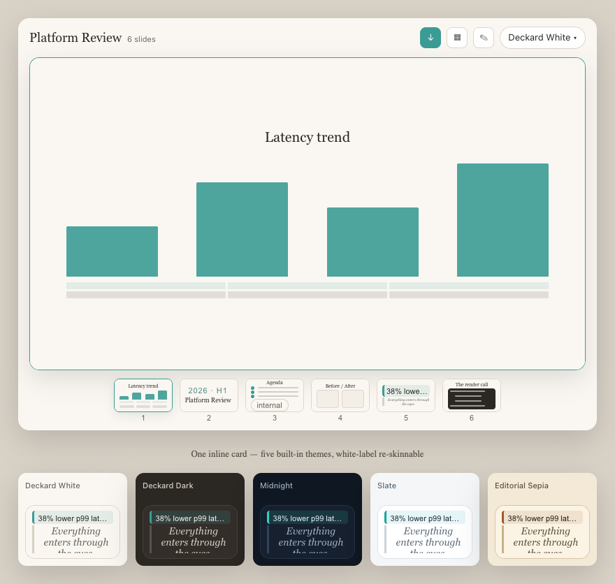

<div align="center">


### Tell your agent what you want. Get a real PowerPoint back.

Deckard is an **agent-first** slides server for the [Model Context Protocol](https://modelcontextprotocol.io).
Your AI agent designs and builds the whole deck through tools — and exports a
genuine `.pptx` you can open, edit, and present. No browser, no Chromium, no
cloud render. One small static binary.

<br/>



</div>

---

## Why Deckard

You shouldn't have to *make* the slides. You should describe them — "a Q2 review,
cover, results with a latency chart, before/after, a roadmap, close" — and have a
deck appear, on-brand and ready to present. Deckard gives your agent the tools to
do exactly that, and the output is a real Office file, not a fragile web preview.

- 🤖 **Agent-first.** Every part of a deck is a tool call. The agent builds a
  complete, complex deck without ever opening a UI.
- 📦 **A real `.pptx`, rendered in pure Go.** Native PowerPoint shapes via
  [pptx-go](https://github.com/hurtener/pptx-go). No headless browser, no
  measure-the-DOM, no service to call. Deterministic — the same deck always
  exports the same file.
- 🎨 **Looks designed, not generated.** A *soul* (a typed theme) carries the
  visual identity. Ships with the warm, editorial **Deckard White**; bootstrap a
  new one from a brand description or a brand `.pptx` in one call.
- 🏷️ **White-label.** Push your client's brand tokens at startup and the review
  surfaces re-skin to match — no rebuild.
- ✅ **Quality is measured.** A built-in **StyleScore** checks contrast (WCAG),
  overflow, and structure before you ship — no Chromium required.
- 🖥️ **Three review surfaces, never in your way.** A glanceable inline preview, a
  drag-to-reorder overview, and a single-slide editor (with an opt-in visual
  canvas) — all driven by the *same* tools the agent uses. A human tweak and an
  agent edit are one operation.

---

## How it works

```
You:    "Make a 6-slide platform review — cover, agenda, before/after,
         a latency chart, the roadmap, and a close. Use our brand."
Agent:  → bootstrap_soul (from your brand)  → create_deck
        → add_slide ×6  → compile_chart  → validate_deck_for_export
        → export_deck
You:    ← a polished platform-review.pptx, ready to present.
```

You stay in the loop the whole time: glance at the inline preview, drag a slide to
reorder it, tweak a headline in the editor — every one of those is the same tool
the agent calls, so nothing gets out of sync.

---

## 5-minute setup

**1. Get the binary.** Download for your platform from
[Releases](https://github.com/hurtener/go-slides-mcp/releases) (Linux / macOS /
Windows, Intel & ARM), or build it:

```bash
go install github.com/hurtener/go-slides-mcp@latest   # → $(go env GOPATH)/bin/go-slides-mcp
```

**2. Connect it to your agent.** Deckard speaks MCP over stdio. Point any MCP
client at the binary — e.g. Claude Desktop (`claude_desktop_config.json`):

```json
{
  "mcpServers": {
    "deckard": {
      "command": "/path/to/deckard",
      "env": { "DECKARD_WORKSPACE": "/path/to/your/decks" }
    }
  }
}
```

(Optional) white-label the surfaces: add `"DECKARD_BRAND_TOKENS": "/path/to/brand.json"`.

**3. Make your agent great at it.** Install the [skills](skills/) so your agent
knows how to drive Deckard with taste — copy the `skills/` folders into your
agent's skills directory.

**4. Ask for a deck.** "Build me a 5-slide intro to our product." That's it.

---

## Teach your agent good taste — the skills

Deckard ships [agent-facing skills](skills/) that turn "can produce a valid deck"
into "produces a deck that looks designed": the build loop, the slide vocabulary,
design principles, theming with souls, charts & code, and validation. Drop them
into the agent you connect.

---

## Under the hood (for the curious)

- **Pure Go, single static binary** (CGo-free). The three review surfaces are
  Svelte apps embedded in the binary.
- **Contract-first.** Typed Go structs are the source of truth; JSON Schema + TS
  are generated.
- **49 tools** covering decks, slides, node-level edits, souls, assets, comments,
  recipes, charts/code, validation, and export.
- Built on the [Dockyard](https://github.com/hurtener/dockyard) MCP framework.

Contributor docs and the engineering plan live in [`docs/`](docs/) and
[`CLAUDE.md`](CLAUDE.md).

---

<div align="center">
<sub>Deckard — agent-first slides, rendered in pure Go.</sub>
</div>
